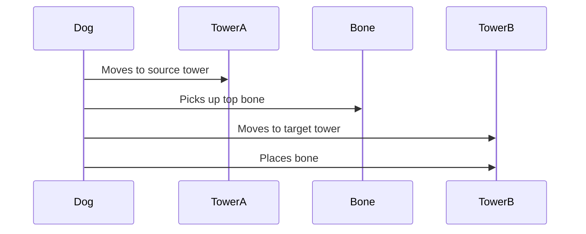

# 🐶 Hanoi Tower with Doggo

A responsive web application that visualizes the Tower of Hanoi algorithm using a playful dog animation. Built with native JavaScript, HTML5, and CSS3 following Material Design principles.

## ✨ Features

- **Interactive Animation**

  - Dog character 🐕 picks up and moves bones (disks) between towers
  - Smooth CSS transitions with JavaScript animation control

- **Two Play Modes**  
  ▶️ **Step-by-step**: Control animation with Play/Pause/Next/Previous buttons  
  ⏩ **Skip to End**: Instantly show final solved state

- **Material Design UI**

  - Clean, responsive layout with shadows and rounded corners
  - Works on both desktop and mobile (H5)

- **Customization**
  - Adjustable animation speed slider
  - Configurable number of disks (3-8 levels)

## 🛠️ Tech Stack

- **Frontend**: Vanilla JavaScript (ES6+), HTML5, CSS3
- **Animation**: CSS Transitions + `requestAnimationFrame`
- **Design**: Material Design (Google Fonts, elevation shadows)
- **Compatibility**: Chrome, Firefox, Safari, Edge (mobile-friendly)

## 🚀 Quick Start

1. **Clone the repo**:

   ```bash
   git clone https://github.com/your-username/hanoi-tower-dog.git
   cd hanoi-tower-dog
   ```

2. **Open in browser**:
   - Double-click `index.html` or use a live server:

````bash
     npx serve
     ```

## 🎮 How to Use

1. **Select disk count** (Default: 3)


2. **Control animation**:
   - ▶️ Play/Pause: Start/stop automatic solving
   - ⏭️ Next/Previous: Move step-by-step
   - 🔄 Reset: Return to initial state
   - ⏩ Skip: Jump to final solution

3. **Adjust speed** with the slider 🎚️

## 🐕‍🦺 Dog Animation Logic


hanoi-tower-dog/
├── index.html          # Main HTML (Material Design structure)
├── style.css           # Material styles + animations
├── script.js           # Hanoi algorithm + dog animation logic
├── assets/
│   ├── dog.svg         # Animated dog sprite
│   └── bark.mp3        # Sound effects
└── README.md
```

## 🌟 Upcoming Features

- [ ] Difficulty levels (Easy/Medium/Hard)
- [ ] Move counter with optimal step calculation
- [ ] LocalStorage save/load game state
- [ ] Multi-language support

## 🤝 Contributing

1. Fork the project
2. Create your branch (`git checkout -b feature/amazing-feature`)
3. Commit changes (`git commit -m 'Add amazing feature'`)
4. Push (`git push origin feature/amazing-feature`)
5. Open a PR

## 📜 License

MIT
